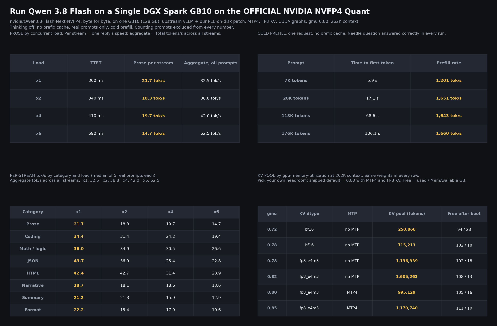

# Run Qwen 3.8 Flash on a Single DGX Spark GB10 on the OFFICIAL NVIDIA NVFP4 Quant

NVIDIA's own checkpoint, `nvidia/Qwen3.8-Flash-Next-NVFP4` (124 GB on disk: 125B-A6B hybrid MoE, 51B n-gram table, 4B MTP head, vision tower), served from **one DGX Spark (GB10, 128 GB unified memory)** with upstream vLLM and a small patch written for this lane. No requantizing, no repacking: the checkpoint is used byte for byte.

It fits because the 47.68 GiB FP8 n-gram (PLE) table never gets loaded: our patch leaves it on the NVMe and reads the 16 rows each token needs on demand. About 76 GiB of real weights stay resident, the rest of the pool is KV cache.

**Default lane: [`single-spark-vllm-tp1/`](single-spark-vllm-tp1/)** (patch, launcher, harness, results, research and credits). The original 2x Spark SGLang TP2 deployment lives on unchanged in [`lanes/sglang-tp2/`](lanes/sglang-tp2/).



## Default configuration (2026-09-05 evening): 43.9 tok/s median on one Spark

Table on disk with the **staged gather** (the 16 rows per token are read in the model state's `prepare_inputs`, before the forward, into a fixed GPU buffer, so decode runs as CUDA graphs with torch.compile off), **reduced-vocabulary MTP draft** (the draft head projects onto the 65,536 lowest token ids and masks the rest, target verifies over the full vocabulary, outputs exact), MTP3, 6 sequences, 4096-token prefill chunk, FP8 KV cache, `gpu-memory-utilization 0.80`, 262,144-token context, thinking off, prefix caching off, vLLM nightly `8a728663`. Both pieces are in `single-spark-vllm-tp1/patch/`, written for this lane; the ideas they follow are credited below.

```bash
bash single-spark-vllm-tp1/launch/qwen38fn-nvidia-tp1.sh      # defaults = this configuration
# the morning stack, if you want it back: PLE_MODE=mmap GRAPHS=piecewise MTP=4 SEQS=8 CHUNK= DRAFT_VOCAB=0 bash single-spark-vllm-tp1/launch/qwen38fn-nvidia-tp1.sh
```

KV pool: **1,027,392 tokens** (3.9 concurrent 262K requests). Weights load in about 10.5 minutes.

Same harness as everything below (40 real prompts, 8 categories x 5, thinking off, no prefix cache, cold prefill; counting prompts excluded):

| Category | tok/s | TTFT | morning stack |
|---|---|---|---|
| Prose | 29.0 | 0.26 s | 21.7 |
| Coding | 44.3 | 0.90 s | 34.4 |
| Math / logic | 45.6 | 0.38 s | 36.0 |
| JSON | 49.3 | 0.34 s | 43.7 |
| HTML | 47.6 | 0.28 s | 42.4 |
| Narrative | 28.5 | 0.37 s | 18.7 |
| Summary | 35.4 | 0.24 s | 21.2 |
| Format | 32.4 | 0.24 s | 22.2 |
| **Median of all 40 prompts** | **43.9** | **0.30 s** | 32.5 |

| Load | TTFT | Per stream (all prompts) | Prose per stream | Aggregate | morning stack (per stream / aggregate) |
|---|---|---|---|---|---|
| x1 | 0.30 s | 43.9 | 29.0 | 43.9 | 32.5 / 32.5 |
| x2 | 0.36 s | 33.4 | 22.9 | 43.9 | 31.0 / 38.8 |
| x4 | 0.47 s | 26.4 | 21.9 | 47.1 | 23.0 / 42.0 |
| x6 | 0.62 s | 21.7 | 17.4 | 68.8 | 19.2 / 62.5 |

Cold prefill: 7K tokens 1,269 tok/s (TTFT 5.6 s), 28K 1,757 (16.1 s), 113K 1,760 (64.0 s), needle answered at every rung. The one number that got worse is the coding TTFT (0.90 s against 0.27 s): the coding prompts are the longest in the set, and every compile-off boot tonight (eager 1.01 s, staged 0.97 s, draft alone 1.22 s, both 0.90 s) shows the same thing, so it comes with running prefill without torch.compile's fused kernels; we have not separated that from the 4096 chunk. Quality score 0.88, same as the morning stack (the misses are word-count caps). Count-to-100 peak, footnote only: 49.4 at one stream, 209.9 aggregate at six (morning stack 43.8 / 194.0). Boot by boot how this was reached, with the MTP4 variant that lost, is in the evening section below and in `single-spark-vllm-tp1/results/kv_pool_ledger.md` (rows 23 to 27).

## Morning stack of 2026-09-05 (superseded the same evening, kept for the record)

### Shipped configuration (morning)

MTP4 on NVIDIA's own draft head, FP8 KV cache, piecewise CUDA graphs, `gpu-memory-utilization 0.80`, 262,144-token context (1M with YaRN is possible, not measured here), thinking off by default, prefix caching off, vLLM nightly `8a728663` (2026-09-04).

```bash
# on a Spark that holds the checkpoint on its local NVMe
bash single-spark-vllm-tp1/launch/qwen38fn-nvidia-tp1.sh      # defaults = this configuration
# endpoint: http://<spark>:8000/v1   model: qwen3.8-flash-next
```

KV pool at this setting: **995,129 tokens** (3.8 concurrent 262K requests). Weights load in about 10 minutes.

## Numbers (measured on the box, 2026-09-05)

Harness: 40 real prompts, 8 categories x 5, thinking off, no prefix cache, cold prefill. Per stream = the speed of one reply; aggregate = total tokens/s across all concurrent streams. Counting prompts are excluded from every number; the count-to-100 sweep is a footnote in the lane README.

### Single stream

| Category | tok/s | TTFT |
|---|---|---|
| Prose | 21.7 | 0.30 s |
| Coding | 34.4 | 0.27 s |
| Math / logic | 36.0 | 0.31 s |
| JSON | 43.7 | 0.34 s |
| HTML | 42.4 | 0.32 s |
| Narrative | 18.7 | 0.30 s |
| Summary | 21.2 | 0.27 s |
| Format | 22.2 | 0.29 s |
| Median of all 40 prompts | 32.5 | 0.30 s |

MTP4 acceptance: 64% overall, 3.56 tokens accepted per step on average. Eager floor without MTP or graphs is 15.4 tok/s on every category. MTP3 was A/B'd against MTP4 on the same 8 prompts (`single-spark-vllm-tp1/results/ab_mtp3_vs_mtp4.log`): a tie on real prompts (overall median 31.8 vs 30.6), MTP4 ahead only on easy-draft text, so MTP4 stays the default.

### Concurrent load

| Load | TTFT | Per stream (all prompts) | Prose per stream | Aggregate |
|---|---|---|---|---|
| x1 | 0.30 s | 32.5 | 21.7 | 32.5 |
| x2 | 0.35 s | 31.0 | 18.3 | 38.8 |
| x4 | 0.44 s | 23.0 | 19.7 | 42.0 |
| x6 | 0.69 s | 19.2 | 14.7 | 62.5 |

### Cold prefill (one request, no prefix cache, needle question answered correctly every time)

| Prompt | Time to first token | Prefill rate |
|---|---|---|
| 7K tokens | 5.9 s | 1,206 tok/s |
| 28K tokens | 17.1 s | 1,654 tok/s |
| 113K tokens | 68.6 s | 1,643 tok/s |
| 176K tokens | 106 s | 1,660 tok/s |
| 200K tokens | 104 s | ~1,900 tok/s |

### Decode latency tail (streaming, prose replies of ~250 words, `tools/itl_probe.py`)

| Streams | TTFT | Step latency p50 / p90 / p99 | Tokens per step | Per-token latency p50 / p99 | Per stream | Aggregate (prose) |
|---|---|---|---|---|---|---|
| 1 | 260 ms | 105 / 113 / 121 ms | 2.16 | 49 / 56 ms | 20.6 tok/s | 20.6 tok/s |
| 6 | 569 ms | 186 / 194 / 203 ms | 2.16 | 86 / 94 ms | 11.6 tok/s | 70.0 tok/s |

One SSE chunk is one MTP step. p99 sits within 10% of p50 at six streams: the on-demand table reads never show up as a tail.

### KV pool by gpu-memory-utilization (262K context, same weights in every row)

| gmu | KV dtype | MTP | KV pool (tokens) | MemAvailable after boot | Note |
|---|---|---|---|---|---|
| 0.72 | bf16 | off | 250,868 | ~28 GB | first boot |
| 0.78 | bf16 | off | 715,213 | ~18 GB | |
| 0.78 | fp8_e4m3 | off | 1,136,939 | ~19 GB | 200K prefill stress passed |
| 0.82 | fp8_e4m3 | off | 1,605,263 | ~13 GB | 176K prefill stress passed |
| **0.80** | **fp8_e4m3** | **MTP4** | **995,129** | **~16 GB** | **shipped default** |
| 0.85 | fp8_e4m3 | MTP4 | 1,170,740 | ~10 GB | serves, passed the 176K stress, but sits at the memory floor |

The MTP head costs roughly 290K tokens of pool at the same gmu. Pick your own headroom; around 10 GB available is where single-Spark runs start to swap.

## Four Sparks (TP4 + expert parallel), same stack

Same flags again, split four ways (`single-spark-vllm-tp1/launch/qwen38fn-nvidia-tp4.sh <rank>` plus `EXTRA=--enable-expert-parallel`, which TP4 needs on GB10; see the credits). One rank reads its checkpoint slice over NFS, the numbers include it.


| | 1 Spark | TP2 | TP4 | TP4 vs 1 Spark |
|---|---|---|---|---|
| KV pool (tokens) | 995,129 | 5,874,061 | 9,088,133 | 9.1x |
| Single stream, median of 40 prompts | 32.5 | 35.8 | 40.5 tok/s | +25% |
| Single stream, prose | 21.7 | 24.1 | 26.4 tok/s | +22% |
| TTFT single stream | 300 | 250 | 220 ms | -27% |
| x4 per stream / aggregate | 23.0 / 42.0 | 27.8 / 43.1 | 32.1 / 51.1 | +40% / +22% |
| x6 per stream / aggregate | 19.2 / 62.5 | 22.3 / 65.5 | 28.5 / 87.4 | +49% / +40% |
| x6 TTFT | 690 | 410 | 370 ms | -46% |
| Prefill 28K / 113K / 176K | 1,654 / 1,643 / 1,660 | 2,093 / 2,061 / 2,038 | 2,453 / 2,299 / 2,233 | +48% / +40% / +35% |

Full tables, boot notes and raw JSON in `single-spark-vllm-tp1/README.md`. One Spark remains the default; the multi-Spark lanes are there for people who own more than one.

## What is in the patch, and credits

- `ple_mmap.py` (new file) and the hooks in `ple_layer.py` (the nightly file plus our hooks, `patch/ple_layer.diff`), plus one line in `compilation.py`: ours. Disk-backed PLE table (positional reads on a thread pool, byte-exact against the checkpoint), 1-row placeholder weight, shard drop at load, a custom op so the gather is a CUDA-graph split point.
- `modelopt.py` overlay: ours, written 2026-09-05. Two fixes so NVIDIA's MTP head loads (draft-local layer index in the quant config; a branch for 128x128 block-scaled FP8 experts). The same two gaps were fixed independently the same day by sfxnz (`sfxnz/Qwen3.8-Flash-Next-NVFP4-vLLM-2x-DGX-Spark`, MIT, commit 13:51 UTC, about two hours before ours) and by MiaAI-Lab (`Qwen3.8-Flash-Next-Dual-DGX-Sparks`, AGPL-3.0, commit 16:07 UTC); no code is shared between the three. Upstream issue draft in `single-spark-vllm-tp1/research/`.
- Credited upstream overlays, unmodified: vLLM PR #55375 (peakcrosser7, MTP conv-state stride fix) and PR #54846 (andreasgru, FP8 KV on the QSA attention path). Leaving the table on disk as an idea is shared with vLLM PR #54129 (Trosfy) and other single-Spark runs; the implementation here is independent. The piecewise-CUDA-graph mode with the PLE lookup registered as a splitting op is the same mode blazux's single-Spark recipe ships (`blazux/qwen3.8-Flash-DGX`, Apache-2.0); Trosfy's early #54129 revision also went through a custom op. Launcher settings taken from community findings: `VLLM_USE_DEEP_GEMM=0` (vLLM issue #54125, jschmied), prefix caching off (vLLM issue #54173, brainatworkharris), `--no-enable-flashinfer-autotune` (jschmied's FlashInfer autotune-cache reports). FP8 KV: PR #54846 (andreasgru) and RFC #54426 (Nanetnounou). The ~10 GB free-memory floor comes from MiaAI-Lab's single-Spark README and blazux's swap/OOM reports. Full prior-art notes, the credit map and the credits audit are in `single-spark-vllm-tp1/research/`. Licensing: Apache-2.0 (`LICENSE`, `NOTICE`); the reference kernel under `lanes/sglang-tp2/community-fix/` is MiaAI-Lab's and AGPL-3.0-or-later.
- TP4 needs `--enable-expert-parallel`: FlashInfer CUTLASS NVFP4 cannot pad the MoE intermediate size four ways (it splits two ways fine). **tsw2000** reported that wall and the expert-parallel way around it on the vLLM tracker before we hit it; the finding is theirs, we only confirmed it on our four boxes.

Details, diffs, launcher knobs, the harness and every raw result: [`single-spark-vllm-tp1/README.md`](single-spark-vllm-tp1/README.md).

## Single Spark, evening of 2026-09-05: graphs with the table on disk, and a cheaper draft

Two pieces of our own code landed tonight, each measured alone on one Spark (gmu 0.80, FP8 KV, 262K, same 40 prompts):

1. **Staged gather (`PLE_MODE=staged`)**: the rows for each step are read from disk inside the model state's `prepare_inputs`, before the forward, into a fixed GPU buffer that the decode CUDA graph reads. That lets one Spark run `{"mode":0,"cudagraph_mode":"FULL_DECODE_ONLY"}` with the 47.7 GB table still on disk, which the in-forward gather could not (a host copy inside graph capture is refused). No vLLM core change: the runner already calls the model state before every step. The shape of the idea is Trosfy's vLLM PR #54129 (gather in input prep, stable buffers); the implementation here is independent, on top of our preadv reader.
2. **Reduced-vocabulary drafting (`DRAFT_VOCAB=65536`)**: the MTP draft head's output projection is computed only for the 65,536 lowest token ids (BPE merge order as the frequency proxy, so no corpus is needed) and every other id is masked to minus infinity, so the target still verifies over the full vocabulary and outputs stay exact. The idea is FR-Spec (frequency-ranked speculative sampling); MiaAI-Lab demonstrated a corpus-built 65,536-token draft vocabulary on this model (AGPL code, not used here). Ours is an overlay of vLLM's `mtp.py`, TP-aware.

Single stream, tok/s:

| Single Spark boot | Median (40) | Prose | Coding | Math | JSON | HTML | Narrative | TTFT |
|---|---|---|---|---|---|---|---|---|
| Shipped (disk, piecewise compile, MTP4, 8 seqs) | 32.5 | 21.7 | 34.4 | 36.0 | 43.7 | 42.4 | 18.7 | 300 ms |
| Eager + recipe (disk, no graphs, MTP3, 6 seqs, chunk 4096) | 35.2 | 23.3 | 37.2 | 38.4 | 40.0 | 38.8 | 23.2 | 290 ms |
| Eager + recipe, MTP4 / 8 seqs | 34.1 | 21.1 | 36.2 | 36.8 | 42.1 | 39.8 | 20.8 | 330 ms |
| Eager + recipe + reduced-vocab draft (65,536) | 37.7 | 27.0 | 42.2 | 43.7 | 44.3 | 44.6 | 26.9 | 340 ms |
| **Staged gather + decode CUDA graphs + recipe** (table on disk) | 37.4 | 25.2 | 39.9 | 39.8 | 42.1 | 42.2 | 24.6 | 310 ms |
| **Both: staged gather + graphs + reduced-vocab draft, MTP3** (new single-Spark default) | **43.9** | **29.0** | 44.3 | 45.6 | 49.3 | 47.6 | 28.5 | 300 ms |
| Both, MTP4 (capture 5..30) | 43.6 | 26.7 | 43.6 | 46.6 | 50.6 | 49.9 | 26.3 | 340 ms |

Both pieces are worth about 15 percent on prose on their own, from different places (graph replay vs a 4x cheaper draft projection), and they stack: together, 43.9 tok/s median single stream against the 32.5 shipped this morning (+35%), prose 29.0 against 21.7. Under load the combination leads at every width (x2 33.4 per stream / 43.9 aggregate, x4 26.4 / 47.1, x6 21.7 / 68.8, against 31.0 / 38.8, 23.0 / 42.0 and 19.2 / 62.5 shipped), with TTFT at six streams down from 690 to 620 ms. The MTP4 variant of the same combination trails MTP3 at every load (single stream 43.6, prose 26.7; x4 23.9 / 44.6), so MTP3 is the single-Spark default from 9 PM on: `~/qwen38fn-nvidia-tp1.sh` with no knobs now boots staged gather + decode graphs + reduced-vocab draft + MTP3 + 6 seqs + 4096 chunk (KV pool 1,027,392 at gmu 0.80). The morning stack is one line, `PLE_MODE=mmap GRAPHS=piecewise MTP=4 SEQS=8 CHUNK= DRAFT_VOCAB=0`.

Load and ceiling rows for the same two boots (counting prompt, footnote only): staged gather + graphs holds the shipped recipe's ceiling exactly (43.7 tok/s at one stream, 189.5 aggregate at six, against 43.8 / 194.0 shipped), so the graphs cost nothing under load; the reduced-vocab draft lifts it (48.7 at one stream, 206.2 aggregate at six). Cold prefill at 7K / 28K / 113K: staged 1,283 / 1,760 / 1,756 tok/s, draft vocab 1,179 / 1,739 / 1,748, shipped 1,277 / 1,745 / 1,758 (the draft has no prefill work, so the differences are run noise).

**TP2 SPEED + reduced-vocab draft (8:45 PM, two Sparks, same harness):** single stream median 53.2 vs 53.7 on the SPEED default (flat); prose 40.8 vs 37.2 (+10%), narrative 38.1 vs 36.5, coding 59.6 vs 56.0, reasoning 61.2 vs 55.9, HTML 65.4 vs 61.1; JSON, summary and format each 2 to 3 tok/s lower. Under load: x2 45.8 / 58.9 aggregate (vs 47.2 / 57.7), x4 37.4 / 69.9 (vs 37.4 / 68.1), x6 31.8 / 105.0 (vs 32.9 / 97.9), with TTFT about 0.1 s worse at four and six streams (0.38 / 0.42 vs 0.26 / 0.31). Cold prefill 1,623 / 2,691 / 2,701 tok/s at 7K / 28K / 113K (same band as SPEED). Peak row 68.1 at one stream, 307 aggregate at six (SPEED: 63.7 / 309). KV pool 1,951,516 (SPEED: 1,970,051). At TP2 the draft projection is already split across two ranks, so the saving is half of what one Spark sees: long-answer categories gain, short structured answers and loaded TTFT give a little back. Shipped as the `DRAFT_VOCAB=65536` knob on the TP2 launcher; whether it becomes the SPEED default is an open decision recorded here rather than made quietly. Quality scores are equal across all rows (the only misses are word-count caps). Load rows, prefill and the KV ledger rows for each boot are under `results/`.

Also measured tonight on the TP2 SPEED profile, none adopted: expert parallel (single stream -4%), MTP4 with `index_share_for_mtp_iteration` (+3% median, prose -6%), `--async-scheduling` (-3% single stream, TTFT worse at every load), NCCL pinned to 8 channels (-3%, within noise). Knobs named by Chuck 208 (@CK2084) and TJ Klug (T-Klug/Qwen3.8-Flash-Next-NVFP4-2xDGX-Spark-vLLM); credited for the pointers even where they did not move this quant.

## SPEED and CONTEXT profiles (TP2 default changed 2026-09-05 evening)

Every lane runs the same official NVIDIA NVFP4 checkpoint on the same vLLM build. The one decision a deployer makes is where the 47.7 GB n-gram table lives, and that sets the profile:

| Profile | Table | Launch (TP2) | What you get | What it costs |
|---|---|---|---|---|
| **SPEED** (TP2 default) | in unified memory, each Spark holds its half (stock loader) | `~/qwen38fn-nvidia-tp2.sh <rank>` (defaults) | 53.7 tok/s median single stream, 97.9 aggregate at six streams, 180 ms TTFT | KV pool 1.97M tokens (7 full 262K contexts) |
| **CONTEXT** | on disk, rows read per step (our patch) | `PLE_MODE=mmap GRAPHS=piecewise MTP=4 SEQS=8 GMU=0.80 ~/qwen38fn-nvidia-tp2.sh <rank>` | KV pool 5.87M tokens (22 full contexts) | 35.8 tok/s median, 65.5 aggregate at six |

One Spark is CONTEXT only: the whole table does not fit next to the weights on a single box. For an agent reading this on someone's behalf, ask one question: fastest replies for a few users (SPEED), or the longest context and the most parallel sessions (CONTEXT).

SPEED profile flags, in vLLM terms: table loaded whole by the stock loader; `--compilation-config '{"mode":0,"cudagraph_mode":"FULL_DECODE_ONLY"}'` (CUDA graphs for decode, torch.compile off); `--speculative-config '{"method":"mtp","num_speculative_tokens":3}'`; `--max-num-seqs 6`; `--max-num-batched-tokens 4096`; `--kv-cache-dtype fp8_e4m3`; `--gpu-memory-utilization 0.70`; prefix caching off; FlashInfer autotune off. These are the SGLang recipe's settings carried over one by one; where the two engines differ, the vLLM equivalent is named in the lane README.

What each piece is worth, measured one at a time on the same two Sparks (single stream, median of 40 prompts): table in memory with compile off and nothing else, 28.4 (a loss: compile's fused kernels matter more than the disk round trip); adding `--max-num-batched-tokens 4096`, 45.1; adding MTP3 and 6 seqs, 53.7. The 4096 prefill chunk is the single biggest lever and also lifts cold prefill from 2,093 to 2,784 tok/s at 28K.

Why compile is off in SPEED: with the table resident, torch.compile's Inductor autotune makes a second copy of the table during compile (~24 GB per Spark at TP2), which starved and rebooted three Sparks here before the cause was found. gau-nernst's open vLLM PR #55272 removes compile from this model for exactly that reason; the finding is theirs. Our patch's resident-slice mode (table hidden from the compiler behind our gather op, `PLE_MODE=resident`) boots with compile on but ran at 8 to 15 tok/s in this build, so it is shipped as experimental only.


**Do not combine the 4096-token prefill chunk with torch.compile on.** Measured 2026-09-05 evening: with piecewise compile the same `--max-num-batched-tokens 4096` that gives +50% under compile-off drops single-stream decode to 8 to 15 tok/s at TP2 and 14.6 tok/s at TP4 (TTFT 800 ms). The SPEED profile therefore always pairs the chunk with `{"mode":0,"cudagraph_mode":"FULL_DECODE_ONLY"}`. CONTEXT keeps the default chunk with compile on. The earlier note that our resident-slice patch mode was slow is superseded: that boot also carried the chunk with compile on, so the cause was this interaction, not the slice; a clean re-test with the default chunk is pending.

**TP4 note (2026-09-05, 5:20 PM):** the SPEED settings do not carry to four Sparks as-is. TP4 with the table in memory, compile off, MTP3, 6 seqs and the 4096 chunk (expert parallel, gmu 0.70, pool 6.25M) measured 29.9 tok/s median single stream against 40.5 for TP4 CONTEXT. With expert parallel across four boxes, losing compile costs more than the recipe settings return. TP4 therefore stays on CONTEXT until the compile-on variants are measured (disk table + recipe settings, then table in memory + compile, which fits at TP4 because the compile-time duplicate is only 12 GB per box). Rows for every boot are in `results/kv_pool_ledger.md`.

**TP4 with the table in unified memory and compile on (9:26 PM, after the second power cut; MTP4, 8 seqs, expert parallel, gmu 0.70, default chunk):** boots clean at TP4 because the compile-time duplicate of the table is only 12 GB per box. Single stream 42.8 median (CONTEXT 40.5), prose 27.0 (26.4), TTFT 200 ms; x2 36.0 / 49.6, x4 35.3 / 55.0, x6 30.0 / 91.6 against CONTEXT's 33.4 / 47.1, 32.1 / 51.1, 28.5 / 87.4, with TTFT 50 ms better at every load. Cold prefill is where it stands out: 3,166 / 3,248 / 3,169 tok/s at 7K / 28K / 113K, the best of any lane (CONTEXT 1,378 / 2,453 / 2,299; TP2 SPEED 1,754 / 2,784 / 2,708), because the per-row disk gather was TP4's prefill cost. KV pool 1,649,797 (CONTEXT 9,088,133). Ceiling 53.8 / 267.5, same as CONTEXT. It still loses to TP2 SPEED on every decode row (53.7 / 97.9 at six) with a smaller pool than TP2 SPEED's 1.97M, so it is not a default: TP2 SPEED for speed, TP4 CONTEXT for the pool, and this TP4 variant only if long-prompt ingestion is the job. Launch: `PLE_MODE=none GRAPHS=piecewise MTP=4 SEQS=8 GMU=0.70 EXTRA=--enable-expert-parallel ~/qwen38fn-nvidia-tp4.sh <rank>`. Ledger row 28. The MTP3 / 6-seq version of the same boot (row 29, pool 1,749,557) measured 38.6 median single stream, prose 25.9, below both the MTP4 variant and CONTEXT; its load rows were lost to the third power cut of the evening (10:55 PM) and were not re-run, since the single-stream row already rules it out. Queue closed there: every boot of 2026-09-05 is a numbered row in the ledger.

### Single stream (x1), tok/s
| | 1 Spark (morning) | 1 Spark (new default) | TP2 CONTEXT (old default) | TP2 SPEED (new default) | TP4 CONTEXT |
|---|---|---|---|---|---|
| Prose | 21.7 | 29.0 | 24.1 | 37.2 | 26.4 |
| Coding | 34.4 | 44.3 | 37.3 | 56.0 | 44.5 |
| Math / logic | 36.0 | 45.6 | 38.9 | 55.9 | 47.2 |
| JSON | 43.7 | 49.3 | 38.2 | 61.9 | 47.8 |
| HTML | 42.4 | 47.6 | 45.1 | 61.1 | 50.7 |
| Narrative | 18.7 | 28.5 | 21.8 | 36.5 | 25.8 |
| Summary | 21.2 | 35.4 | 26.0 | 42.8 | 27.3 |
| Format | 22.2 | 32.4 | 25.4 | 38.4 | 26.8 |
| **Median of all 40** | **32.5** | **43.9** | **35.8** | **53.7** | **40.5** |
| TTFT (ms) | 300 | 300 | 250 | 180 | 220 |

### Under load (per stream tok/s / aggregate tok/s / TTFT)
| Load | 1 Spark (morning) | 1 Spark (new default) | TP2 CONTEXT (old default) | TP2 SPEED (new default) | TP4 CONTEXT |
|---|---|---|---|---|---|
| x2 per stream / aggregate / TTFT | 31.0 / 38.8 / 350 ms | 33.4 / 43.9 / 360 ms | 32.1 / 40.6 / 290 ms | 47.2 / 57.7 / 220 ms | 33.4 / 47.1 / 250 ms |
| x4 per stream / aggregate / TTFT | 23.0 / 42.0 / 440 ms | 26.4 / 47.1 / 470 ms | 27.8 / 43.1 / 340 ms | 37.4 / 68.1 / 260 ms | 32.1 / 51.1 / 310 ms |
| x6 per stream / aggregate / TTFT | 19.2 / 62.5 / 690 ms | 21.7 / 68.8 / 620 ms | 22.3 / 65.5 / 410 ms | 32.9 / 97.9 / 310 ms | 28.5 / 87.4 / 370 ms |

### Cold prefill, tok/s (needle answered correctly at every rung)
| Prompt | 1 Spark (morning) | 1 Spark (new default) | TP2 CONTEXT (old default) | TP2 SPEED (new default) | TP4 CONTEXT |
|---|---|---|---|---|---|
| 7K | 1,206 | 1,269 | 1,433 | 1,754 | 1,378 |
| 28K | 1,654 | 1,757 | 2,093 | 2,784 | 2,453 |
| 112K | 1,643 | 1,760 | 2,061 | 2,708 | 2,299 |

### KV pool
| | 1 Spark (morning) | 1 Spark (new default) | TP2 CONTEXT (old default) | TP2 SPEED (new default) | TP4 CONTEXT |
|---|---|---|---|---|---|
| KV pool (tokens) | 995,129 | 1,027,392 | 5,874,061 | 1,970,051 | 9,088,133 |

Counting-to-100 ceiling (footnote, never a headline), x1 / x6 aggregate: 1 Spark (morning) 44 / 194; 1 Spark (new default) 49 / 210; TP2 CONTEXT (old default) 51 / 234; TP2 SPEED (new default) 64 / 309; TP4 CONTEXT 54 / 262. Quality scores equal within noise on every lane (the two SPEED prompts that lost points ran 1 and 4 words over a word cap).

## Two Sparks (TP2), CONTEXT profile, same stack as one Spark

Same launcher family, same flags (MTP4, FP8 KV, CUDA graphs, gmu 0.80, 262K), split across two Sparks over the ConnectX fabric (`single-spark-vllm-tp1/launch/qwen38fn-nvidia-tp2.sh`). Same 40 prompts, same harness, cold prefill.


| | 1 Spark | 2 Sparks (TP2) | Change |
|---|---|---|---|
| KV pool (tokens) | 995,129 | 5,874,061 | 5.9x |
| Single stream, median of 40 prompts | 32.5 tok/s | 35.8 tok/s | +10% |
| Single stream, prose | 21.7 tok/s | 24.1 tok/s | +11% |
| TTFT single stream | 300 ms | 250 ms | -17% |
| x4 per stream / aggregate | 23.0 / 42.0 | 27.8 / 43.1 | +21% / +3% |
| x6 per stream / aggregate | 19.2 / 62.5 | 22.3 / 65.5 | +16% / +5% |
| x6 TTFT | 690 ms | 410 ms | -41% |
| Prefill 28K / 113K / 176K | 1,654 / 1,643 / 1,660 | 2,093 / 2,061 / 2,038 | +27% / +25% / +23% |

What TP2 buys: every reply is faster, the first token arrives sooner, prefill is a quarter faster, and the KV pool is nearly six times larger. What it does not buy: aggregate batch throughput barely moves, because MTP4 already fills the batch on one Spark. Quality scores are identical. Full tables and raw JSON in `single-spark-vllm-tp1/README.md`.

