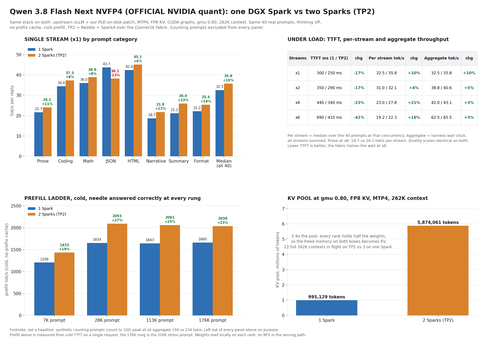
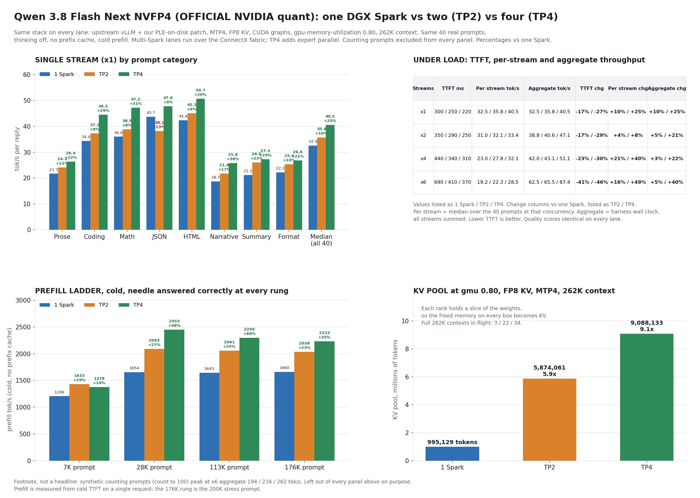
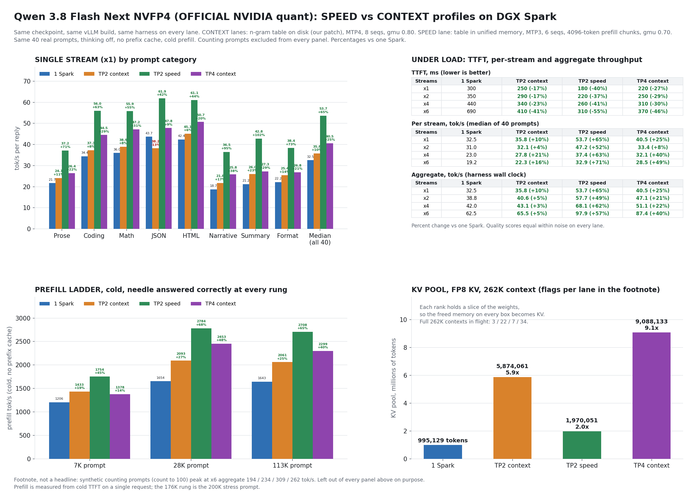

# Qwen3.8-Flash-Next NVFP4 on ONE DGX Spark, vLLM, TP1

NVIDIA's own checkpoint, `nvidia/Qwen3.8-Flash-Next-NVFP4` (124 GB on disk, 125B-A6B hybrid MoE + 51B n-gram table + 4B MTP), served from a single DGX Spark (GB10, 128 GB unified memory) with upstream vLLM main and a three-file patch (`ple_mmap.py`, hooks in `ple_layer.py`, one line in `compilation.py`) plus a two-fix `modelopt.py` overlay, all written for this lane. No requantizing, no repacking: the checkpoint is used byte for byte.

Status: serving as of 2026-09-05. Numbers below are from the harness in `tools/`, cold prefill only, real prompts only; the count-to-100 ceiling is reported once at the bottom and never as a headline.

## Why it fits

| Piece | Size | Where it lives |
|---|---|---|
| Model weights (experts NVFP4, attention and shared experts BF16, MTP experts FP8, vision tower) | ~76 GiB | GPU (unified pool) |
| PLE n-gram table (320,001,536 rows x 160 B, FP8, one global scale) | 47.68 GiB | **Left on the NVMe.** Each token needs exactly 16 rows (2.5 KB), read on demand |
| KV cache | what is left inside `gpu-memory-utilization` x pool | GPU |

Upstream vLLM main (nightly `8a728663`, 2026-09-04) has the NVIDIA-checkpoint loader (PR #53896, #54882) but no PLE offload of any kind: the four table-relief PRs are all open. Without a patch the skeleton allocates the full 47.68 GiB table and nothing fits.

## The patch (ours)

`patch/ple_mmap.py` (new file, mounted as `vllm/models/qwen4_exp/nvidia/ops/ple_mmap.py`)
- Parses the safetensors headers through `model.safetensors.index.json`, finds the 128 row shards of the PLE layer, keeps one file descriptor per file (`POSIX_FADV_RANDOM`).
- Gathers rows with positional reads (`preadv`) on a thread pool into a pinned staging buffer, then one async copy into a GPU buffer. An mmap version was written first and measured: page faults serialize on the process `mmap_lock` (10-20K rows/s cold regardless of thread count); `preadv` scales with NVMe queue depth (131K rows/s cold at 64 threads on the Spark's NVMe).
- Returns the FP8 rows unchanged; vLLM's stock global-scale dequant runs as before.

`patch/ple_layer.py` (nightly file + hooks, see `patch/ple_layer.diff`)
- Allocates a 1-row placeholder instead of the 47.68 GiB table at construction.
- Validates and drops the shard tensors at load time (they would otherwise hit the loader's TP-range copy).
- Looks rows up through a registered custom op (`vllm::qwen4_exp_ple_mmap_gather`) so torch.compile treats the host gather as opaque and, with `patch/compilation.py` (one line added to `_attention_ops`), as a piecewise CUDA-graph split point. This is the same graph mode blazux's recipe uses (its `vllm_ple_mmap.py` runs as an opaque splitting op under PIECEWISE) and Trosfy's early #54129 revision; here it comes from vLLM's own `_attention_ops` list, which already carries `qwen4_exp_compute_ple_ngram_ids`.
- Builds the reader once at weight-load time; the traced forward touches only tensors and constants (Dynamo cannot construct thread pools).

Measured reader cost on Reddie (CPU-only container, cold = after `drop_caches`, byte-exact against raw reads): 8K-token prefill (131,072 rows) 1.0 s cold, 0.64 s warm; 64-token decode batch 23 ms cold, 8 ms warm; single token ~0 ms warm.

## Upstream overlays (credited, unmodified upstream code)

`patch/upstream-overlays/` contains two upstream diffs applied onto the nightly's files, because they were not in the image we run:
- **PR #55375, peakcrosser7, merged 2026-09-05**: fused PLE conv state-index stride fix. Without it, MTP plus more than one concurrent prefill writes conv state to the wrong slot.
- **PR #54846, andreasgru, open**: fp8_e4m3 and nvfp4 KV cache on the QSA attention path (`--kv-cache-dtype fp8_e4m3`). Stock vLLM refuses anything but BF16 KV on this model. Related RFC #54426 by Nanetnounou documented the same four sm_121 integration points independently.

Both are upstream vLLM contributions by their authors; nothing else in this lane is derived from anyone's repo.

`patch/upstream-overlays/modelopt.py` is different: it is the nightly's file plus **two fixes of ours** for loading NVIDIA's MTP head (see `patch/modelopt_mtp_index.diff`):
- NVIDIA's `hf_quant_config.json` keys the MTP experts as `mtp.layers.0.mlp.experts` while vLLM (and the checkpoint's own tensor names) number that layer `mtp.layers.48`; the mixed-precision resolver never matched, so the experts were built without their scales. We add the draft-local index as a lookup candidate.
- The mixed-precision config had no branch for `FP8_BLOCK_SCALES` experts at all (only NVFP4, per-tensor FP8, MXFP8); the MTP experts are 128x128 block-scaled FP8. We route that algo to vLLM's generic block-FP8 MoE method.
Both are being reported upstream (`research/upstream-issue-modelopt-mtp-index.md`). The same two gaps were fixed independently the same day by sfxnz (`docker/modelopt.py` in `sfxnz/Qwen3.8-Flash-Next-NVFP4-vLLM-2x-DGX-Spark`, MIT, commit 13:51 UTC, about two hours before ours) and by MiaAI-Lab (`files/patch_modelopt_fp8_block_moe.py` in `Qwen3.8-Flash-Next-Dual-DGX-Sparks`, AGPL-3.0, commit 16:07 UTC); the three implementations share no code. The idea of leaving the table on disk is shared with vLLM PR #54129 (Trosfy) and with community single-Spark runs; the implementation here is independent (see `research/` for the prior-art notes and credit map).

## Launch

```bash
# on the Spark that holds the checkpoint locally (random reads over NFS would crawl)
IMAGE=vllm/vllm-openai:nightly-8a728663c1c3eeace834a95f5654fa653cc1998c \
PLE_MODE=mmap PLE_WORKERS=64 GRAPHS=piecewise MTP=4 KV_DTYPE=fp8_e4m3 \
GMU=0.80 MAXLEN=262144 SEQS=8 bash launch/qwen38fn-nvidia-tp1.sh   # these are also the script's defaults
```

Knobs: `PLE_MODE` (mmap | none), `GRAPHS` (eager | piecewise), `MTP` (0 | N), `KV_DTYPE` (auto | fp8_e4m3 | nvfp4), `OVERLAYS` (1 | 0), `GMU`, `MAXLEN`, `SEQS`, `PATCH_DIR`, `EXTRA`. Prefix caching is off by default (`PREFIX_CACHE_ARG`) until the GDN prefix-cache crash reported in vLLM #54173 (brainatworkharris) is verified fixed in this image. The launcher sets `VLLM_USE_DEEP_GEMM=0` (DeepGEMM faults on sm_121: vLLM issue #54125, jschmied), `VLLM_USE_V2_MODEL_RUNNER=1` (pins the V2 runner the nightly already selects), and `--no-enable-flashinfer-autotune` (FlashInfer autotune-cache failures on GB10 reported by jschmied); `CUTE_DSL_ARCH=sm_121a`, `TORCH_CUDA_ARCH_LIST=12.1a` and `expandable_segments` are the standard Spark vLLM environment (Flaviu Vlaicu's playbook, eugr's images, and our own earlier recipes).

Endpoint: `http://<spark>:8000/v1`, model `qwen3.8-flash-next`, thinking off by default (`enable_thinking` per request).

## Memory settings measured (KV pool ledger)

One row per boot. Same weights resident in every row; only the KV pool moves.

| gmu | Context | KV dtype | Graphs | MTP | KV pool (tokens) | KV GiB | Free after boot | Result |
|---|---|---|---|---|---|---|---|---|
| 0.72 | 131,072 | bf16 | eager | 0 | 250,868 | 6.6 | ~28 GB | serves (first boot) |
| 0.78 | 262,144 | bf16 | eager | 0 | 715,213 | 17.5 | ~18 GB | serves |
| 0.78 | 262,144 | bf16 | piecewise | 0 | 581,8xx | ~14.2 | ~21 GB | serves; torch.compile + graphs reserve ~130K tokens |
| 0.78 | 262,144 | fp8_e4m3 | eager | 0 | 1,136,939 | 14.7 | ~19 GB | serves; 200K prefill stress passed |
| 0.82 | 262,144 | fp8_e4m3 | eager | 0 | 1,605,263 | 20.8 | ~13 GB | serves; 176K prefill stress passed (1,660 tok/s) |
| **0.80** | **262,144** | **fp8_e4m3** | **piecewise** | **4** | **995,129** | **16.6** | **~16 GB** | **shipped default (this README's numbers)** |
| 0.85 | 262,144 | fp8_e4m3 | piecewise | 4 | 1,170,740 | ~19.5 | ~10 GB | serves and passed the 176K stress (1,571 tok/s), but MemAvailable sat at 9.8 GB afterwards: works, tight, not the default |

MTP4's draft head costs roughly 290K tokens of pool at the same gmu. `free -g` on a GB10 counts page cache as used; the "free after boot" column is `MemAvailable`. Community reports put the danger line around 10 GB available: MiaAI-Lab's single-Spark README says to keep MemAvailable at or above ~10 GiB under load, and blazux reports gmu 0.85 drifting into swap after a day and 0.875 OOM-killed on a 300K prefill with MTP. So 0.80 with MTP is the shipped setting and 0.82 is the ceiling we would recommend without MTP.

Weights load in ~9-10 minutes: the loader still streams the 47.68 GiB PLE file through RAM before the shards are dropped. Skipping those shards in the iterator is the next load-time improvement.

## Results (shipped default: MTP4 + FP8 KV + piecewise graphs, gmu 0.80, 262K)

Harness: 40 real prompts, 8 categories x 5, thinking off, no prefix cache, one Spark (GB10). "Per stream" is the median speed of one reply; "aggregate" is total tokens/s the box delivers across all concurrent streams (all categories mixed). Cold prefill only. Counting prompts are not in any of these numbers.

### Single stream (x1), per category

| Category | tok/s | TTFT | Auto score |
|---|---|---|---|
| Prose | 21.7 | 0.30 s | 0.35 (word-range overruns, text reads well) |
| Coding | 34.4 | 0.27 s | 1.00 |
| Math / logic | 36.0 | 0.31 s | 1.00 |
| JSON | 43.7 | 0.34 s | 1.00 |
| HTML | 42.4 | 0.32 s | 0.93 |
| Narrative | 18.7 | 0.30 s | 0.69 (length) |
| Summary | 21.2 | 0.27 s | 0.75 |
| Format | 22.2 | 0.29 s | 1.00 |
| Median of all 40 | 32.5 | 0.30 s | 0.84 |

MTP4 acceptance on this checkpoint: mean accepted length 3.56, 64% overall, per position 0.90 / 0.66 / 0.53 / 0.40. Structured output (code, JSON, HTML) accepts drafts often and roughly doubles the eager floor of 15.4 tok/s; free prose accepts less and gains about 1.4x.

### Concurrent load

| Load | TTFT (median) | Per stream (median, all prompts) | Prose per stream | Aggregate |
|---|---|---|---|---|
| x1 | 0.30 s | 32.5 | 21.7 | 32.5 |
| x2 | 0.35 s | 31.0 | 18.3 | 38.8 |
| x4 | 0.44 s | 23.0 | 19.7 | 42.0 |
| x6 | 0.69 s | 19.2 | 14.7 | 62.5 |

### Cold prefill (one request, no prefix cache, needle question answered correctly every time)

| Prompt | Time to first token | Prefill rate |
|---|---|---|
| 7K tokens | 5.9 s | 1,206 tok/s |
| 28K tokens | 17.1 s | 1,654 tok/s |
| 113K tokens | 68.6 s | 1,643 tok/s |
| 176K tokens (gmu 0.82, no MTP) | 106 s | 1,660 tok/s |
| 200K tokens (gmu 0.78, no MTP) | 104 s | ~1,900 tok/s |

### Eager floor (for reference)

No graphs, no MTP, bf16 KV, gmu 0.72: 15.4 tok/s single stream on every category, 26.9 tok/s aggregate at x4, TTFT 0.26 s.

### Counting ceiling (footnote, not a benchmark)

Count-to-100 sweep (`results/sweep_qwen38fn_tp1_mtp4_fp8_080.json`), aggregate tok/s: x1 43.8, x2 89.9, x3 128.8, x4 151.9, x5 175.4, x6 194.0. This is the best case for speculative decoding (near-perfect draft acceptance) and is not representative of real work, which is why it is not in the tables above.

## Files

- `patch/` the two patched files, their diffs against the nightly, the compilation overlay, `upstream-overlays/`
- `launch/qwen38fn-nvidia-tp1.sh` single-Spark launcher
- `tools/` benchmark harness (`bench_lane.sh`, `bench_categories.py`, `bench_sweep.py`, `stress_prefill.py`, `probe-qwen38fn.sh`)
- `results/` raw JSON per run, the KV pool ledger, the harness and stress logs, and the chart images (`chart_*_all.png` is the one-image summary; `tools/make_tweet_charts.py` builds them from the JSON)
- `research/` runner internals notes and the GB10 prior-art / pitfalls survey with the credit map

## TP2 lane (two Sparks, same stack)

`launch/qwen38fn-nvidia-tp2.sh <0|1>` runs the identical stack across two Sparks over the RoCE fabric: rank 1 = worker (Spark4, 192.168.192.4, `--headless`), rank 0 = head (Reddie, 192.168.192.2, serves :8000). Start the worker first, then the head. Each rank mounts its own local copy of the checkpoint: the disk-backed table is read locally on every rank (random reads over NFS would crawl), and our lookup returns full rows on each rank, so no vocab-parallel all-reduce is needed for the table. Networking is the same NCCL-over-RoCE block the GLM TP4 lane uses (`NCCL_IB_HCA=rocep1s0f0`, GID 3, `enp1s0f0np0`).

Boot: weights 321 s + draft head 67 s + graphs 5 s, about 10 minutes launch to serve.

KV pool at gmu 0.80 (the default): **5,874,061 tokens (52 GiB), 22 concurrent 262K requests**. The head node sits at ~10.5 GB available at 0.80. If 0.80 gives you trouble on your boxes, `GMU=0.75` is the stable fallback (roughly 4.5M tokens of KV, scaled from the 0.80 measurement, not measured separately).


### TP2 results (same harness; single Spark / TP2, with the change)

Single stream (x1), per category, tok/s:

| Category | 1 Spark | TP2 | Change |
|---|---|---|---|
| Prose | 21.7 | 24.1 | +11% |
| Coding | 34.4 | 37.3 | +8% |
| Math / logic | 36.0 | 38.9 | +8% |
| JSON | 43.7 | 38.2 | -13% |
| HTML | 42.4 | 45.1 | +6% |
| Narrative | 18.7 | 21.8 | +17% |
| Summary | 21.2 | 26.0 | +23% |
| Format | 22.2 | 25.4 | +14% |
| Median of all 40 | 32.5 | 35.8 | +10% |

Concurrent load (1 Spark / TP2):

| Load | TTFT | Per stream (all prompts) | Prose per stream | Aggregate |
|---|---|---|---|---|
| x1 | 300 / 250 ms (-17%) | 32.5 / 35.8 (+10%) | 21.7 / 24.1 | 32.5 / 35.8 (+10%) |
| x2 | 350 / 290 ms (-17%) | 31.0 / 32.1 (+4%) | 18.3 / 19.5 | 38.8 / 40.6 (+5%) |
| x4 | 440 / 340 ms (-23%) | 23.0 / 27.8 (+21%) | 19.7 / 20.0 | 42.0 / 43.1 (+3%) |
| x6 | 690 / 410 ms (-41%) | 19.2 / 22.3 (+16%) | 14.7 / 16.1 | 62.5 / 65.5 (+5%) |

Quality scores are identical between the two shapes (coding, math, JSON, format 1.0 at every load). TP2's gains are per-reply speed and time to first token; batch aggregate barely moves because it is paced by the longest reply in each batch and MTP already fills the batch. The KV pool is the big difference: 5,874,061 tokens vs 995,129.

Cold prefill ladder (1 Spark / TP2, tok/s, needle answered correctly at every rung):

| Prompt | 1 Spark | TP2 | Change |
|---|---|---|---|
| 7K | 1,206 | 1,433 | +19% |
| 28K | 1,654 | 2,093 | +27% |
| 113K | 1,643 | 2,061 | +25% |
| 176K (200K stress) | 1,660 | 2,038 | +23% |

TTFT on the 176K prompt: 106 s on one Spark, 86 s on TP2. Both lanes were healthy after the stress run.

Footnote, never a headline: the synthetic counting-to-100 ceiling at x6 is 194 tok/s aggregate on one Spark and 234 on TP2.



Raw: `results/categories_qwen38fn_tp2_mtp4_fp8_080_off_c{1,2,4,6}.json`, `results/prefill_qwen38fn_tp2_mtp4_fp8_080.txt`, `results/sweep_qwen38fn_tp2_mtp4_fp8_080.json`, `results/stress_tp2_080_200k.log`, `results/bench_tp2_mtp4_fp8_080.log`. Chart: `tools/make_tp2_charts.py`; comparison: `tools/compare_lanes.py`.


## Four Sparks (TP4 + expert parallel), same stack

`launch/qwen38fn-nvidia-tp4.sh <rank>` on all four boxes (workers first: 3 Bluey, 2 Asusi, 1 Spark4, then head 0 Reddie), same flags as the single-Spark default (MTP4, FP8 KV, piecewise CUDA graphs, gmu 0.80, 262K) plus `EXTRA=--enable-expert-parallel`.

Why expert parallel: the first TP4 boot loaded weights and then stopped with `NotImplementedError: Intermediate size padding for w1 and w3, for FLASHINFER_CUTLASS NvFp4 backend`. The MoE intermediate size does not split four ways for the FlashInfer CUTLASS NVFP4 kernel (it does split two ways, which is why TP2 needs nothing extra). With expert parallel each rank owns whole experts instead of a slice of every expert, so nothing needs padding. tsw2000 reported the same wall and the same way around it on the vLLM tracker before we hit it; that finding is theirs.

Asusi reads its checkpoint slice over an NFS mount of Reddie's copy (`MODEL_HOST=/mnt/reddie-models/...`); the other three ranks read local NVMe. The disk-backed PLE table works either way: the numbers below include the NFS rank.

Boot: weights 218 s + 65 s (MTP draft), engine init 135 s. Per rank: 23.1 GiB weights and non-torch, 72.2 GiB KV. **KV pool 9,088,133 tokens (34.7 full 262K contexts)** vs 5,874,061 at TP2 and 995,129 on one Spark.

Single stream (x1), per category, tok/s:

| Category | 1 Spark | TP2 | TP4 | TP4 vs 1 Spark |
|---|---|---|---|---|
| Prose | 21.7 | 24.1 | 26.4 | +22% |
| Coding | 34.4 | 37.3 | 44.5 | +29% |
| Math / logic | 36.0 | 38.9 | 47.2 | +31% |
| JSON | 43.7 | 38.2 | 47.8 | +9% |
| HTML | 42.4 | 45.1 | 50.7 | +20% |
| Narrative | 18.7 | 21.8 | 25.8 | +38% |
| Summary | 21.2 | 26.0 | 27.3 | +29% |
| Format | 22.2 | 25.4 | 26.8 | +21% |
| Median of all 40 | 32.5 | 35.8 | 40.5 | +25% |

TTFT single stream: 300 / 250 / 220 ms. Quality score identical (0.84).

Concurrent load (1 Spark / TP2 / TP4; change = TP4 vs 1 Spark):

| Load | TTFT | Per stream (all prompts) | Prose per stream | Aggregate |
|---|---|---|---|---|
| x1 | 300 / 250 / 220 ms (-27%) | 32.5 / 35.8 / 40.5 (+25%) | 21.7 / 24.1 / 26.4 | 32.5 / 35.8 / 40.5 (+25%) |
| x2 | 350 / 290 / 250 ms (-29%) | 31.0 / 32.1 / 33.4 (+8%) | 18.3 / 19.5 / 23.9 | 38.8 / 40.6 / 47.1 (+21%) |
| x4 | 440 / 340 / 310 ms (-30%) | 23.0 / 27.8 / 32.1 (+40%) | 19.7 / 20.0 / 24.3 | 42.0 / 43.1 / 51.1 (+22%) |
| x6 | 690 / 410 / 370 ms (-46%) | 19.2 / 22.3 / 28.5 (+49%) | 14.7 / 16.1 / 21.5 | 62.5 / 65.5 / 87.4 (+40%) |

Quality scores identical across the three shapes. TP4 is where aggregate finally moves: +40% at six streams, with every stream still running faster than a single stream did on one Spark.

Cold prefill ladder (1 Spark / TP2 / TP4, tok/s, needle answered correctly at every rung):

| Prompt | 1 Spark | TP2 | TP4 | TP4 vs 1 Spark |
|---|---|---|---|---|
| 7K | 1,206 | 1,433 | 1,378 | +14% |
| 28K | 1,654 | 2,093 | 2,453 | +48% |
| 113K | 1,643 | 2,061 | 2,299 | +40% |
| 176K (200K stress) | 1,660 | 2,038 | 2,233 | +35% |

TTFT on the 176K prompt: 106 s / 86 s / 79 s. No hang at 113K or 176K with expert parallel on this nightly (a long-prefill hang above ~75K at TP4+EP was reported on an earlier build by tsw2k; not reproduced here).

Footnote, never a headline: the synthetic counting-to-100 ceiling at x6 is 194 / 234 / 262 tok/s aggregate.



Raw: `results/categories_qwen38fn_tp4_mtp4_fp8_080_ep_off_c{1,2,4,6}.json`, `results/prefill_qwen38fn_tp4_mtp4_fp8_080_ep.txt`, `results/sweep_qwen38fn_tp4_mtp4_fp8_080_ep.json`, `results/stress_tp4_080_200k.log`, `results/bench_tp4_mtp4_fp8_080_ep.log`. Chart: `tools/make_scaling_charts.py`.

## SPEED and CONTEXT profiles (TP2 default changed 2026-09-05 evening)

Every lane runs the same official NVIDIA NVFP4 checkpoint on the same vLLM build. The one decision a deployer makes is where the 47.7 GB n-gram table lives, and that sets the profile:

| Profile | Table | Launch (TP2) | What you get | What it costs |
|---|---|---|---|---|
| **SPEED** (TP2 default) | in unified memory, each Spark holds its half (stock loader) | `~/qwen38fn-nvidia-tp2.sh <rank>` (defaults) | 53.7 tok/s median single stream, 97.9 aggregate at six streams, 180 ms TTFT | KV pool 1.97M tokens (7 full 262K contexts) |
| **CONTEXT** | on disk, rows read per step (our patch) | `PLE_MODE=mmap GRAPHS=piecewise MTP=4 SEQS=8 GMU=0.80 ~/qwen38fn-nvidia-tp2.sh <rank>` | KV pool 5.87M tokens (22 full contexts) | 35.8 tok/s median, 65.5 aggregate at six |

One Spark is CONTEXT only: the whole table does not fit next to the weights on a single box. For an agent reading this on someone's behalf, ask one question: fastest replies for a few users (SPEED), or the longest context and the most parallel sessions (CONTEXT).

SPEED profile flags, in vLLM terms: table loaded whole by the stock loader; `--compilation-config '{"mode":0,"cudagraph_mode":"FULL_DECODE_ONLY"}'` (CUDA graphs for decode, torch.compile off); `--speculative-config '{"method":"mtp","num_speculative_tokens":3}'`; `--max-num-seqs 6`; `--max-num-batched-tokens 4096`; `--kv-cache-dtype fp8_e4m3`; `--gpu-memory-utilization 0.70`; prefix caching off; FlashInfer autotune off. These are the SGLang recipe's settings carried over one by one; where the two engines differ, the vLLM equivalent is named in the lane README.

What each piece is worth, measured one at a time on the same two Sparks (single stream, median of 40 prompts): table in memory with compile off and nothing else, 28.4 (a loss: compile's fused kernels matter more than the disk round trip); adding `--max-num-batched-tokens 4096`, 45.1; adding MTP3 and 6 seqs, 53.7. The 4096 prefill chunk is the single biggest lever and also lifts cold prefill from 2,093 to 2,784 tok/s at 28K.

Why compile is off in SPEED: with the table resident, torch.compile's Inductor autotune makes a second copy of the table during compile (~24 GB per Spark at TP2), which starved and rebooted three Sparks here before the cause was found. gau-nernst's open vLLM PR #55272 removes compile from this model for exactly that reason; the finding is theirs. Our patch's resident-slice mode (table hidden from the compiler behind our gather op, `PLE_MODE=resident`) boots with compile on but ran at 8 to 15 tok/s in this build, so it is shipped as experimental only.



**TP4 note (2026-09-05, 5:20 PM):** the SPEED settings do not carry to four Sparks as-is. TP4 with the table in memory, compile off, MTP3, 6 seqs and the 4096 chunk (expert parallel, gmu 0.70, pool 6.25M) measured 29.9 tok/s median single stream against 40.5 for TP4 CONTEXT. With expert parallel across four boxes, losing compile costs more than the recipe settings return. TP4 therefore stays on CONTEXT until the compile-on variants are measured (disk table + recipe settings, then table in memory + compile, which fits at TP4 because the compile-time duplicate is only 12 GB per box). Rows for every boot are in `results/kv_pool_ledger.md`.

### Single stream (x1), tok/s
| | 1 Spark (CONTEXT) | TP2 CONTEXT (old default) | TP2 SPEED (new default) | TP4 CONTEXT |
|---|---|---|---|---|
| Prose | 21.7 | 24.1 | 37.2 | 26.4 |
| Coding | 34.4 | 37.3 | 56.0 | 44.5 |
| Math / logic | 36.0 | 38.9 | 55.9 | 47.2 |
| JSON | 43.7 | 38.2 | 61.9 | 47.8 |
| HTML | 42.4 | 45.1 | 61.1 | 50.7 |
| Narrative | 18.7 | 21.8 | 36.5 | 25.8 |
| Summary | 21.2 | 26.0 | 42.8 | 27.3 |
| Format | 22.2 | 25.4 | 38.4 | 26.8 |
| **Median of all 40** | **32.5** | **35.8** | **53.7** | **40.5** |
| TTFT (ms) | 300 | 250 | 180 | 220 |

### Under load (per stream tok/s / aggregate tok/s / TTFT)
| Load | 1 Spark (CONTEXT) | TP2 CONTEXT (old default) | TP2 SPEED (new default) | TP4 CONTEXT |
|---|---|---|---|---|
| x2 per stream / aggregate / TTFT | 31.0 / 38.8 / 350 ms | 32.1 / 40.6 / 290 ms | 47.2 / 57.7 / 220 ms | 33.4 / 47.1 / 250 ms |
| x4 per stream / aggregate / TTFT | 23.0 / 42.0 / 440 ms | 27.8 / 43.1 / 340 ms | 37.4 / 68.1 / 260 ms | 32.1 / 51.1 / 310 ms |
| x6 per stream / aggregate / TTFT | 19.2 / 62.5 / 690 ms | 22.3 / 65.5 / 410 ms | 32.9 / 97.9 / 310 ms | 28.5 / 87.4 / 370 ms |

### Cold prefill, tok/s (needle answered correctly at every rung)
| Prompt | 1 Spark (CONTEXT) | TP2 CONTEXT (old default) | TP2 SPEED (new default) | TP4 CONTEXT |
|---|---|---|---|---|
| 7K | 1,206 | 1,433 | 1,754 | 1,378 |
| 28K | 1,654 | 2,093 | 2,784 | 2,453 |
| 112K | 1,643 | 2,061 | 2,708 | 2,299 |

### KV pool
| | 1 Spark (CONTEXT) | TP2 CONTEXT (old default) | TP2 SPEED (new default) | TP4 CONTEXT |
|---|---|---|---|---|
| KV pool (tokens) | 995,129 | 5,874,061 | 1,970,051 | 9,088,133 |

Counting-to-100 ceiling (footnote, never a headline), x1 / x6 aggregate: 1 Spark (CONTEXT) 44 / 194; TP2 CONTEXT (old default) 51 / 234; TP2 SPEED (new default) 64 / 309; TP4 CONTEXT 54 / 262. Quality scores equal within noise on every lane (the two SPEED prompts that lost points ran 1 and 4 words over a word cap).


### Experiment log for the SPEED profile (all TP2, 2026-09-05 afternoon)

| Boot | Table | Compile | MTP | seqs | chunk | gmu | KV pool | x1 median | Outcome |
|---|---|---|---|---|---|---|---|---|---|
| stock resident | RAM | on (piecewise) | 4 | 8 | default | 0.80 | n/a | n/a | both Sparks starved and rebooted at the compile step (Inductor duplicate of the table) |
| stock resident | RAM | on (full) | 4 | 8 | default | 0.70 | n/a | n/a | third Spark rebooted, same step; stop |
| stock resident | RAM | off, FULL_DECODE_ONLY | 4 | 8 | default | 0.70 | 1,898,635 | 28.4 | boots; slower than disk (compile fusions lost) |
| stock resident | RAM | off | 4 | 8 | 4096 | 0.70 | 1,832,462 | 45.1 | chunk alone recovers most of it; peak row 66.9 |
| stock resident | RAM | off | 3 | 6 | 4096 | 0.70 | 1,970,051 | 53.7 | **SPEED default** |
| ours, resident slice | RAM (our patch) | on (piecewise) | 3 | 6 | 4096 | 0.70 | 1,278,944 | 8 to 15 | boots clean, too slow as implemented; experimental |
| stock resident + `--moe-backend flashinfer_cutlass` | RAM | off | 3 | 6 | 4096 | 0.70 | n/a | n/a | refused at load: the FP8 MTP experts (64x64 block scales) have no CUTLASS path on this build |

Raw JSON for every row is under `results/` (`categories_<lane>_off_c{1,2,4,6}.json`, `sweep_<lane>.json`, `prefill_<lane>.txt`, `bench_*.log`).
